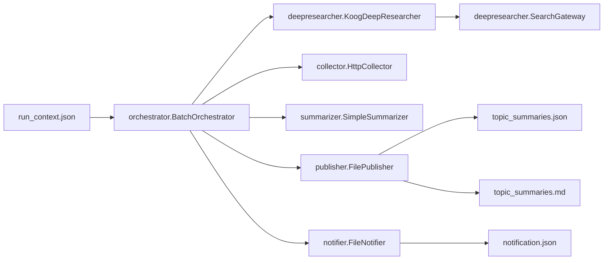
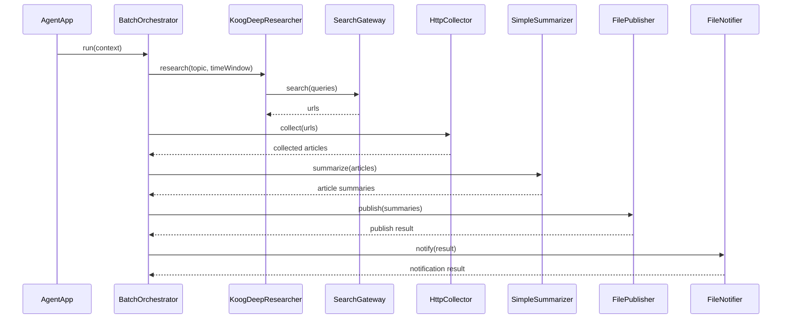

# bulknews-agent

Batch app that reads a run context JSON and emits topic summaries as JSON.

## Usage

```bash
./gradlew :app:run
```

Input/output paths are resolved via environment variables:

- `BULKNEWS_INPUT` (default: `run_context.json`)
- `BULKNEWS_OUTPUT` (default: `build/output/topic_summaries.json`)
- `BULKNEWS_OUTPUT_DIR` (default: `build/output`)
- `BULKNEWS_NOTIFY_OUTPUT` (default: `build/output/notification.json`)

External dependencies:

- `OPENAI_API_KEY` (Koog deep research planning)
- `SERPER_API_KEY` (search results; Serper-compatible)

## System Architecture



## Batch Flow



## Input (RunContext)

```json
{
  "topics": ["Kotlin 2.x compiler"],
  "time_window": "past 7 days",
  "max_items_per_topic": 3
}
```
