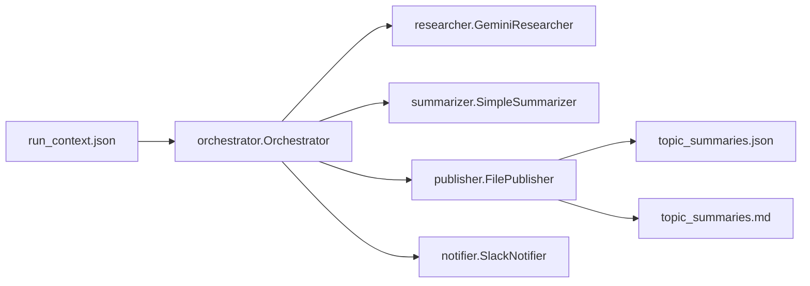
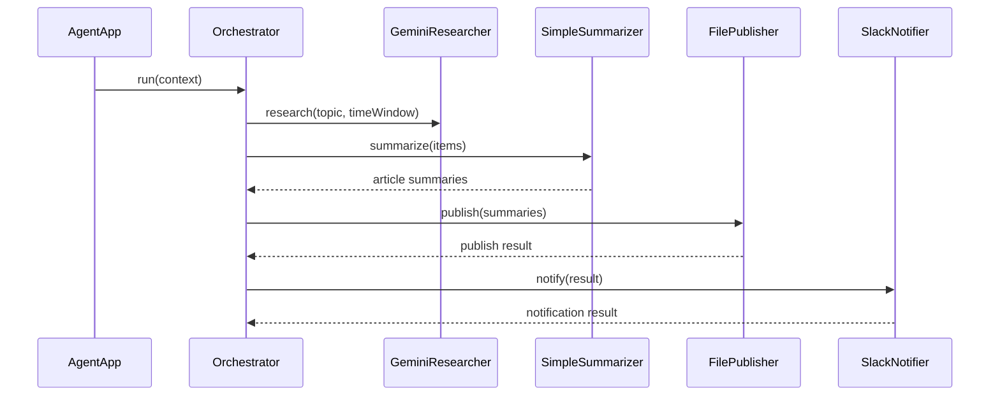

# bulknews-agent

Batch app that reads a run context JSON and emits topic summaries as JSON.

## Usage

```bash
./gradlew :app:run
```

Input/output paths are resolved via environment variables:

- `BULKNEWS_INPUT`
- `BULKNEWS_OUTPUT`
- `BULKNEWS_OUTPUT_DIR`
- `BULKNEWS_NOTIFY_OUTPUT`

External dependencies:

- `OPENAI_API_KEY`
- `GOOGLE_API_KEY` - Required for GeminiResearcher to perform web research using Google's Gemini API

## System Architecture



## Batch Flow



## Input (RunContext)

```json
{
  "topics": ["Kotlin 2.x compiler"],
  "time_window": "past 7 days",
  "max_items_per_topic": 3
}
```
